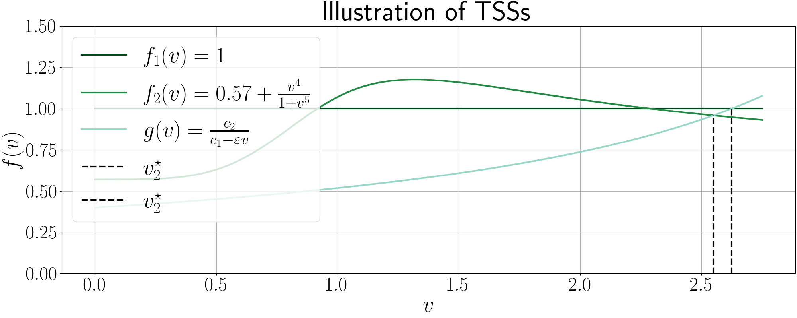
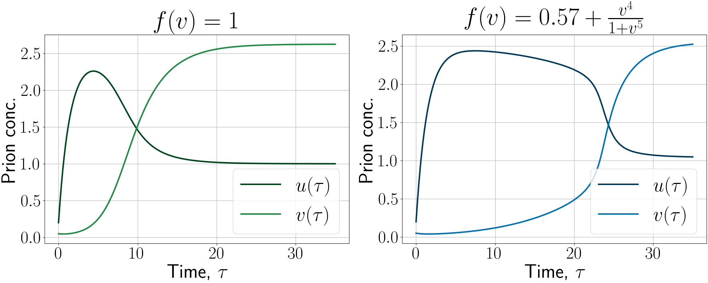
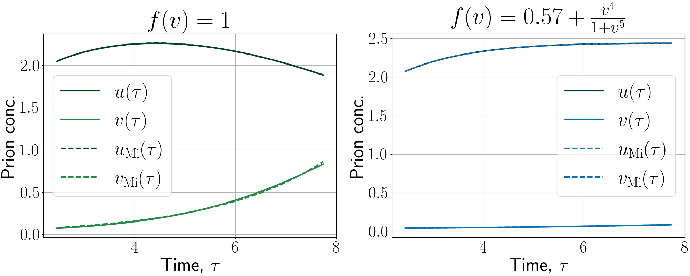

# HeMiTo-dynamics: a characterisation of mammalian prion toxicity
**Written by:** Johannes Borgqvist, 
**Date:** 2024-07-12. 
Welcome to the github-repositry associated with the manuscript "*HeMiTo-dynamics: a characterisation of mammalian prion toxicity using non-dimensionalisation, linear stability and perturbation analyses*". In the Code-folder, the Python script "*HeMiTo.py*" generates the figures presented in the manuscript. These figures are also saved in the Figure folder. 

First, the script visualises the v-coordinates of the TSSs as the intersections between the functions f and g. 

Then, we plot the solutions of the original ODE-system. In other words, we visualise the phases characterising HeMiTo-dynamics.

We plot the approximations in the He-phase.

Lastly, we plot the approximations in the Mi-phase. 

